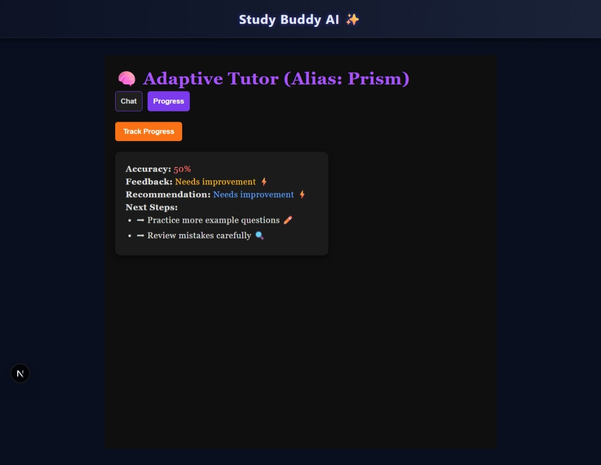

## Study Buddy AI – Adaptive Tutor Agent

📚 Prism — Adaptive Study Buddy (AI)

Prism is an AI-powered adaptive tutor built with Next.js + Prisma and designed to run with either Google Gemini API (cloud) or Ollama (LLaMA) locally.
It answers questions, generates short practice quizzes, tracks progress, and gives personalized next-step recommendations.

Tagline: Prism — your AI-powered study companion that explains, quizzes, and adapts.

✨ What Prism does (quick, human-friendly summary)

When you ask the Study Buddy a question (Chat Mode), Prism responds with a helpful learning package — not just one-line answers:

Clear definition of the topic / concept. 📘

Concrete examples so the concept clicks. 🌍

A small practice quiz question to test understanding. 📝

Next-step personalized recommendation (e.g., study notes, videos, practice sets). 🚀

The Progress Tracker records quiz results, computes accuracy, provides feedback (e.g., Needs improvement / Excellent), and suggests next steps. Data is persisted with SQLite + Prisma.

📁 Repo structure (your repo)
app/
 ├─ api/
 │   ├─ chat/
 │   │  ├─ route.ts            # AI chat endpoint
 │   │  └─ studyBuddyService.ts# core AI logic (called by route)
 │   └─ progress/
 │      └─ route.ts            # Progress tracking endpoint (POST/GET)
 ├─ page.tsx                   # Main UI (Chat + Progress tabs)
 ├─ globals.css
 └─ layout.tsx

generated/prisma/              # Prisma client output
prisma/
 ├─ schema.prisma
 ├─ migrations/
 └─ dev.db                     # local SQLite DB

.env.local                     # environment variables (API keys, DB)
package.json
README.md

🛠️ Tech stack

Frontend & backend: Next.js (App Router) + React + Tailwind CSS

DB: SQLite (local) + Prisma ORM

AI engines: Google Gemini API (default in your repo) — or a local Ollama (LLaMA) model

Language: TypeScript

🚀 Quick start (local)

1. Clone repo

git clone https://github.com/snehaella5/AI-Adaptive-Tutor.git
cd ai-adaptive-tutor


2. Install dependencies

npm install

3. Environment Variables
Create .env.local in project root and add:

DATABASE_URL="file:./prisma/dev.db"
# If using Gemini:
GEMINI_API_KEY="your_gemini_key_here"
# Choose provider: "gemini" or "ollama"
AI_PROVIDER="gemini"


Pull & run Ollama only if you want to use local LLaMA:

# pull model (one-time)
ollama pull llama3

# run the server (keep this terminal open)
ollama serve

4.Database Setup
Run Prisma migrations (creates dev.db and Prisma client)

npx prisma migrate dev --name init


Start the Next dev server

5. Run the Development Server
npm run dev


6. Open the app:

http://localhost:3000

🔬 Test the API endpoints (manual)
Chat (Chat Mode)

7. Send a prompt to the chat endpoint:

curl -X POST http://localhost:3000/api/chat \
  -H "Content-Type: application/json" \
  -d '{"prompt":"Explain Newton\'s Laws of Motion"}'


Expected response shape (example):

{
  "response": "Newton's laws... (definition + example + a quiz + next steps)"
}

Progress (save a run)
curl -X POST http://localhost:3000/api/progress \
  -H "Content-Type: application/json" \
  -d '{"studentId":"student-1","answers":[{"questionId":1,"isCorrect":true},{"questionId":2,"isCorrect":false}]}'


Expected JSON:

{
  "accuracy": 50,
  "feedback": "Needs improvement",
  "recommendation": "Revise current topic",
  "nextSteps": ["Practice more example questions","Review mistakes carefully"]
}


Fetch recent progress (GET):

curl http://localhost:3000/api/progress

🔁 Switch between Gemini and Ollama

Your repo is built to support both. it’s controlled by AI_PROVIDER in .env.local.

In app/api/chat/route.ts or studyBuddyService.ts implement a small switch:

const provider = process.env.AI_PROVIDER || "gemini";

if (provider === "ollama") {
  // call local Ollama server
  const res = await fetch("http://localhost:11434/api/generate", {
    method: "POST",
    headers: {"Content-Type": "application/json"},
    body: JSON.stringify({ model: "llama3:latest", prompt }),
  });
  const json = await res.json();
  return json.response;
} else {
  // call Gemini (cloud): use your GEMINI_API_KEY
  // (your code may use the specific Gemini client / HTTP call you already have)
  const reply = await callGemini(prompt); // placeholder for your Gemini call
  return reply;
}


Keep your API key secure and do not commit .env.local.

✅ Good practices & debugging

If Chat returns undefined:

Confirm AI_PROVIDER and .env.local keys are set.

If using Ollama: ensure ollama serve (or ollama run llama3) is running and curl http://localhost:11434/api/tags returns your model.

Check terminal logs for your Next server — console.log the raw data you get from the model API to see the shape.

To inspect DB data:

npx prisma studio

# opens a web UI to inspect tables (Progress)

🧭 UX: what the Chat returns (the learning package)

When you type a topic, Prism will typically return:

Definition — concise and clear (what it is).

Example(s) — easy-to-relate examples.

Mini quiz — one practice question (MCQ or short question) to check understanding.

Next-step recommendation — short list of how to progress (videos, practice, summary).

This is what makes Prism an adaptive study buddy — it explains, checks, and recommends next steps.

### Screenshots
Home Interface


Chat Mode


Progress Tracking
 


## How the AI Agent Works  

```mermaid
flowchart TD
    A[User Question] --> B[Frontend: Next.js UI]
    B --> C[API: /api/chat]
    C --> D[AI Model Layer]
    D -->|Gemini API or Ollama| E[AI Response]
    E --> F[Service Layer: studyBuddyService.ts]
    F --> G[Structured Output: Definition, Examples, Quiz, Recommendations]
    G --> H[Frontend: Display Response]

    A2[Track Progress] --> B2[Frontend: Progress Tab]
    B2 --> C2[API: /api/progress]
    C2 --> D2[Prisma ORM + SQLite]
    D2 --> E2[Store Accuracy & Feedback]
    E2 --> F2[Recommendations]
    F2 --> B2


This diagram explains:  

- **Chat Flow**: User asks → API forwards → Model (Gemini/Ollama) → AI response → Service formats → Frontend shows structured content.  
- **Progress Flow**: User tracks → API call → Prisma/SQLite stores results → Recommendations → Displayed back in UI.  


Installation

Clone the Repository

git clone https://github.com/snehaella5/AI-Adaptive-Tutor.git
cd ai-adaptive-tutor


Install Dependencies

npm install


Environment Variables
Create a .env.local file with:

DATABASE_URL="file:./prisma/dev.db"
GEMINI_API_KEY="your_gemini_api_key"


To use Ollama instead, configure the endpoint URL accordingly.

Database Setup

npx prisma migrate dev --name init


Run the Development Server

npm run dev


Visit http://localhost:3000 in your browser.

Usage

Chat with the AI Agent
Type any question in the chat input. The AI agent responds with definitions, examples, quizzes, and recommendations.

Track Progress
Switch to the Progress tab to see accuracy, feedback, and suggested next steps based on your interactions.

Switch Models

By default, uses Gemini API.

Configure .env.local to use Ollama if running models locally.

Roadmap

User authentication and persistent progress across sessions.

Subject expansion (math, computer science, etc.).

Rich visualization dashboards for analytics.

Support for additional LLM providers.

Contributing

Fork the repository.

Create a feature branch (git checkout -b feature/your-feature).

Commit changes (git commit -m 'Add new feature').

Push to the branch (git push origin feature/your-feature).

Open a Pull Request.

License

This project is licensed under the MIT License.

## Documentation  

- [Introduction](./docs/introduction.md)  
- [System Architecture](./docs/architecture.md)  
- [Setup Guide](./docs/setup.md)  
- [Usage Guide](./docs/usage.md)  
- [API Reference](./docs/api.md)  
- [Future Work](./docs/future-work.md)  
